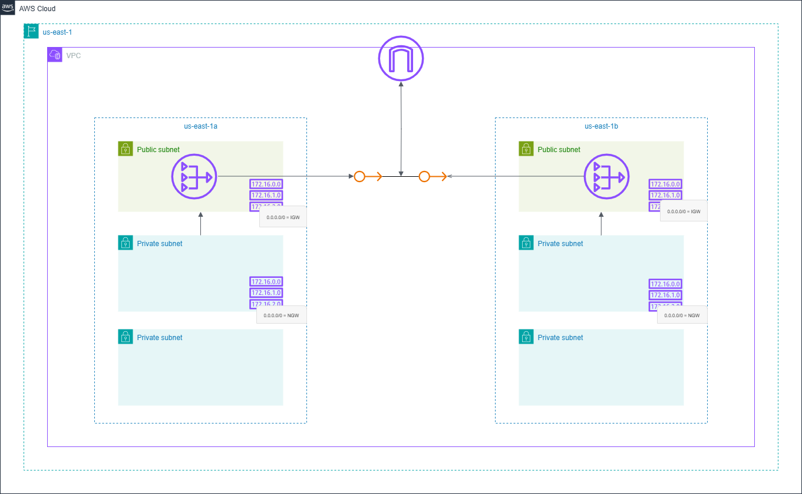

# 🚀 Terraform - VPC Module

### 📌 Overview

This is a reusable Terraform module to provision a VPC network on AWS. This module sets up the core networking components needed for a secure and scalable infrastructure.

### 🛠️ Tech Stack


### ✨ Features

- Provisions a __VPC__ with a configurable CIDR block and customizable name

- Creates __public, private, and database subnets__ across the specified Availability Zones with user-defined CIDR ranges

- Configures an __Internet Gateway (IGW__) to enable outbound access for public subnets

- Allocates an __Elastic IP__ for the NAT Gateway

- Deploys a __NAT Gateway__ to provide secure internet access for private subnets

- Sets up __route tables and associates__ them with subnets for proper public and private routing
### 📂 Project Structure

```
Project2-vpc-module/
├── modules/
│   └── vpc-module/
│       ├── elastic-ip.tf            # Elastic IP for NAT Gateway in each Public subnet
│       ├── internet-gateway.tf      # Internet Gateway resource
│       ├── nat-gateway.tf           # NAT Gateway resource in each Public subnet
│       ├── route_table.tf           # Route tables and associations
│       ├── subnets.tf               # Public, private, and DB subnets
│       ├── variables.tf             # Input variables for the module
│       ├── vpc.auto.tfvars          # Variable values (auto-loaded)
│       └── vpc.tf                   # VPC resource definition
├── Project2-vpc-module.png          # Exported PNG of the diagram
├── variables.tf                     # Root-level variables
├── versions.tf                      # Terraform and provider configurations
└── vpc.tf                           # Root-level module call
```

### 📂 Project Structure

```
Project2-vpc-module/
├── modules/
│   └── vpc-module/
│       ├── elastic-ip.tf            # Elastic IP for NAT Gateway in each Public subnet
│       ├── internet-gateway.tf      # Internet Gateway resource
│       ├── nat-gateway.tf           # NAT Gateway resource in each Public subnet
│       ├── route_table.tf           # Route tables and associations
│       ├── subnets.tf               # Public, private, and DB subnets
│       ├── variables.tf             # Input variables for the module
│       ├── vpc.auto.tfvars          # Variable values (auto-loaded)
│       └── vpc.tf                   # VPC resource definition
├── Project2-vpc-module.png          # Exported PNG of the diagram
├── variables.tf                     # Root-level variables
├── versions.tf                      # Terraform and provider configurations
└── vpc.tf                           # Root-level module call
```

### 📖 Prerequisites

- Terraform Version ≥ 1.8.3
- AWS provider version ≥ 6.4.0
- AWS CLI configured with valid credentials

### ⚙️ Usage 

1. Clone the repository
```
git clone https://github.com/ritushinde36/terraform-projects.git
cd Project2-vpc-module
```

2. Here’s an example of how to call the module from your root vpc.tf:  
Note: The below configuration is only an example.
You should adjust the CIDR blocks, availability zones, and feature flags according to your project’s requirements.
```
module "vpc" {
    source = "./modules/vpc-module"
    vpc_cidr_block = "10.0.0.0/16"
    vpc_name = "TF_VPC"

    avail_zones = ["us-east-1a","us-east-1b"]
    private_subnet_cidrs = ["10.0.1.0/24","10.0.2.0/24"]
    public_subnet_cidrs = ["10.0.3.0/24","10.0.4.0/24"]
    database_subnet_cidrs = ["10.0.5.0/24","10.0.6.0/24"]

    enable_internet_gateway = true
    enable_NAT_gateway = true
    
}
```

3. Initialize Terraform
```
terraform init
```

4. Preview the resources
```
terraform plan
```

5. Deploy the infrastructure
```
terraform apply
```

6. Destroy resources (when done)
```
terraform destroy
```

### 🛠 Inputs  


| Name                     | Type   | Default | Description |
|--------------------------|--------|---------|-------------|
| `vpc_cidr_block`         | string | n/a     | CIDR block for the VPC |
| `vpc_name`               | string | TF_VPC  | Name to assign to the VPC |
| `avail_zones`            | list   | n/a     | List of availability zones to deploy subnets into |
| `public_subnet_cidrs`    | list   | n/a     | List of public subnet CIDR blocks |
| `private_subnet_cidrs`   | list   | n/a     | List of private subnet CIDR blocks |
| `database_subnet_cidrs`  | list   | n/a     | List of database subnet CIDR blocks |
| `enable_internet_gateway`| bool   | false   | Whether to create an Internet Gateway |
| `enable_NAT_gateway`     | bool   | false   | Whether to create a NAT Gateway |


### 🗺️ Architecture Diagram

The following diagram shows the architecture created by this module:



### 🙋 Author  

**Ritu Shinde**  

- 📧 [Email](mailto:shinderitu36@gmail.com)  
- 💼 [LinkedIn](https://www.linkedin.com/in/ritu-shinde-345a98323)  
- 💻 [GitHub](https://github.com/ritushinde36)  
- 🌐 [Blog](https://ritushinde.hashnode.dev/)  