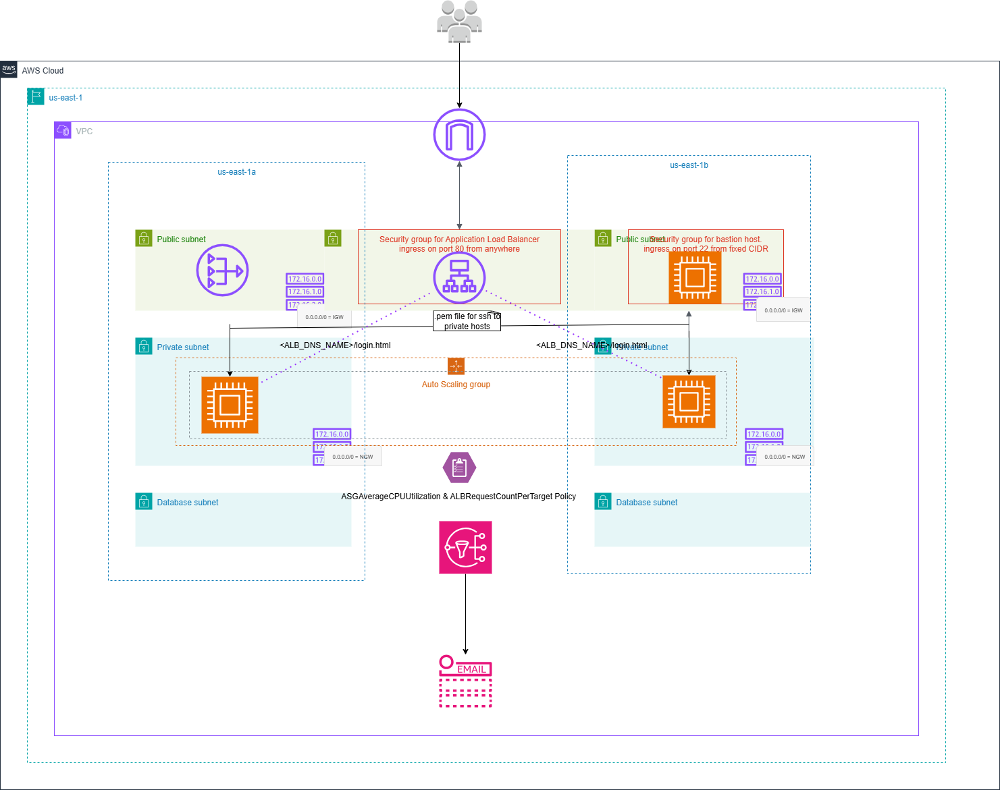

# 🚀 Terraform - EC2 & ALB & ASG with Target Tracking & SNS Alerts Module

### 📌 Overview

This project provisions a highly available and scalable web application infrastructure on AWS using Terraform.

An Application Load Balancer (ALB) distributes traffic across EC2 instances.

The EC2 instances run inside an Auto Scaling Group (ASG) for elasticity and fault tolerance.

A Target Tracking Scaling Policy ensures the number of instances scales in/out automatically based on average CPU utilization and ALB requests per target.

An Amazon CloudWatch Alarm is triggered when scaling actions are required.

The alarm is connected to an SNS Topic, which sends email notifications for scaling events.


It leverages the following custom modules - 
- Application Load Balancer Listner Module
- Application Load Balancer Module
- Auto Scaling Module
- EC2 Module
- EIP Module
- SG Module
- Target Group Module
- VPC Module
- SNS Module

### 🛠️ Tech Stack


### ✨ Features

- VPC Module → Creates VPC, public, private, and database subnets, route tables and associations, NAT Gateway, Elastic IP and internet gateway. Refer the git repo for VPC module and example - [vpc-module](https://github.com/ritushinde36/terraform-projects/tree/master/Project2-vpc-module)

- EC2, Security Group ,EIP Module → Launches EC2 instances and bastion hosts in the configured VPC & subnets. Manages ingress/egress rules for Bastion and private instances.Associates Elastic IPs with EC2 instances.Refer the git repo for this module and example - [ec2-sg-eip-module](https://github.com/ritushinde36/terraform-projects/tree/master/Project3-EC2-SG-EIP-module)

- ALB Module - Creates a DNS name to forward traffic to the EC2 instances present in a subnet across multiple availability zones.Refer the git repo for this module and example - [ec2-alb-module](https://github.com/ritushinde36/terraform-projects/tree/master/Project4-EC2-ALB-module)

- ASG Module - To ensure the number of instances scales in/out automatically based on average CPU utilization and ALB requests per target

- SNS Module - To send email notification for the scaling action

### 📂 Project Structure

```
Project7-ASG-SNS-module/
├── modules/
│   ├── ec2-module/                     # EC2 instance creation
│   │   ├── data.tf                     # Data sources for fetching latest AMI
│   │   ├── ec2.tf                      # EC2 resource definitions
│   │   ├── output.tf                   # Outputs (instance IDs, public IPs, private IPs)
│   │   └── variables.tf                # Input variables for EC2 module
│   │
│   ├── asg-module/                     # Auto Scaling Group (ASG) module
│   │   ├── asg.tf                    # Defines ASG, Launch Template, and scaling policies
│   │   ├── data.tf                   # Data sources for AMI Lookup
│   │   ├── output.tf                 # Outputs 
│   │   └── variables.tf              # Input variables for the ASG module
│   │
│   ├── sns-module/                   # SNS Terraform module
│   │   ├── output.tf                 # Outputs for SNS resources
│   │   ├── sns.tf                    # Main configuration for SNS topic and subscriptions
│   │   └── variables.tf              # Input variables for the SNS module
│   │
│   ├── eip-module/                     # Elastic IP assignment to instance
│   │   ├── eip.tf                      # Elastic IP resource definition
│   │   ├── output.tf                   # Outputs (EIP Public IP)
│   │   └── variables.tf                # Input variables for EIP module
│   │
│   ├── sg-module/                      # Security groups
│   │   ├── data.tf                     # Data sources (VPC ID)
│   │   ├── sg.tf                       # Security group and ingress/egress rules resource definitions
│   │   ├── output.tf                   # Outputs (SG ID)
│   │   └── variables.tf                # Input variables for SG module
│   │
│   ├── vpc-module/                     # VPC + networking
│   │   ├── vpc.tf                      # VPC resource definition
│   │   ├── subnets.tf                  # Public, private, and DB subnet creation
│   │   ├── internet-gateway.tf         # Internet Gateway resource
│   │   ├── nat-gateway.tf              # NAT Gateway resource in each Public subnet
│   │   ├── route_table.tf              # Route tables and associations
│   │   ├── elastic-ip.tf               # Elastic IP for NAT Gateway in each Public subnet
│   │   ├── variables.tf                # Input variables for VPC module
│   │
│   ├── alb-module/                     # Application Load Balancer
│   │   ├── alb.tf                      # ALB resource definition
│   │   ├── output.tf                   # Outputs
│   │   └── variables.tf                # Input variables for ALB module
|   | 
│   ├── alb-listener-module/            # ALB Listener configuration
│   │   ├── alb-listener.tf             # ALB Listener resource definition
│   │   ├── outputs.tf                  # Outputs
│   │   └── variables.tf                # Input variables for ALB Listener module
│   │
│   ├── tg-module/                      # Target Group configuration
│   │   ├── tg.tf                       # Target Group & attachment resouce definition
│   │   ├── outputs.tf                  # Outputs
│   │   └── variables.tf                # Input variables for Target Group module
│   │
│   └── clb-module/                     # Classic Load Balancer
│       ├── clb.tf                      # CLB resource definition and example usage
│       ├── output.tf                   # Outputs
│       └── variables.tf                # Input variables for CLB module
│
├── Private_Key/                        # SSH keys for EC2 access
│
├── resource-information/               # Infra documentation
│   └── vpc-creation-details.txt        # Info about VPC after creation
│
├── user_data/                              # EC2 user data scripts
│   └── home_user_data_script.sh            # Script to bootstrap instance with home.html
│
├── alb.tf                                  # Application Load Balancer configuration  
├── asg.tf                                  # Auto Scaling Group configuration  
├── sns.tf                                  # SNS configuration  
├── ec2.tf                                  # EC2 instance configuration  
├── eip.tf                                  # Elastic IP configuration  
├── listener.tf                             # ALB Listener configuration  
├── local.tf                                # Local values definitions  
├── null_resource.tf                        # Null resources for provisioning  
├── rds.tf                                  # RDS instance configuration  
├── sg.tf                                   # Security Group configuration  
├── tg.tf                                   # Target Group configuration  
├── vpc.tf                                  # VPC configuration  
├── variables.tf                            # Global input variables
├── versions.tf                             # Provider + Terraform version constraints
├── local.tf                                # Local values for reuse in configs
│
├── ec2.auto.tfvars                         # Variable file for EC2 module
├── sns.auto.tfvars                         # Variable file for SNS module
├── sg.auto.tfvars                          # Variable file for SG module
├── vpc.auto.tfvars                         # Variable file for VPC module
├── alb.auto.tfvars                         # Variable file for ALB module
├── rds.auto.tfvars                         # Variable file for RDS module 
├── asg.auto.tfvars                         # Variable file for ASG module 
│
├── terraform.tfvars                        # Default variables
│
├── README.md                               # Project documentation
└── Project7-ASG-SNS-module.png                 # Architecture diagram


```

### 📖 Prerequisites

- Terraform Version ≥ 1.8.3
- AWS provider version ≥ 6.4.0
- AWS CLI configured with valid credentials

### ⚙️ Usage 

1. Clone the repository
```
git clone https://github.com/ritushinde36/terraform-projects.git
cd Project7-ASG-SNS-module
```

2. It is creating the following resources - 
    - VPC
    - Bastion host present in the public subnets
    - EC2 private hosts present in the private subnets
    - Bastion security group that will allow ssh access from anywhere
    - EC2 security group that will only allow ssh and http access from the vpc cidr block
    - Elastic IP for the bastion host
    - null resources that will -
        - copy the pem file onto the bastion host , so ssh is possible from bastion host to the EC2 private host
        - update the permissions of the .pem file
        - store the VPC details on the local machine executing this terraform code
    - ALB that will route traffic to the EC2 instances in the private subnet
    - ALB security group that will allow http traffic as ingress
    - Target group containing both the the EC2 instances in the private subnets
    - ALB listener attached to the ALB that forward http traffic to the Target Group
        - Requests to <ALB_DNS>/login.html are routed to the EC2 instance serving the login page.
        - Requests to <ALB_DNS>/home.html are routed to the EC2 instance serving the home page.
    - EC2 instances are present in an autoscaling group
    - Target Tracking Policy auto-scales instances based on CPU utilization and ALB request load
    - An Amazon CloudWatch Alarm is triggered when scaling actions are required
    - The alarm is connected to an SNS Topic, which sends email notifications for scaling events.


3. Initialize Terraform
```
terraform init
```

4. Preview the resources
```
terraform plan
```

5. Deploy the infrastructure
```
terraform apply
```

6. Destroy resources (when done)
```
terraform destroy
```

### 🔧 Inputs  

#### 📦 VPC Module (vpc-module)

| Name                      | Type   | Default | Description                                       |
| ------------------------- | ------ | ------- | ------------------------------------------------- |
| `vpc_cidr_block`          | string | n/a     | CIDR block for the VPC                            |
| `vpc_name`                | string | TF\_VPC | Name to assign to the VPC                         |
| `avail_zones`             | list(string)   | n/a     | List of availability zones to deploy subnets into |
| `public_subnet_cidrs`     | list(string)   | n/a     | List of public subnet CIDR blocks                 |
| `private_subnet_cidrs`    | list(string)   | n/a     | List of private subnet CIDR blocks                |
| `database_subnet_cidrs`   | list(string)   | n/a     | List of database subnet CIDR blocks               |
| `enable_internet_gateway` | bool   | false   | Whether to create an Internet Gateway             |
| `enable_NAT_gateway`      | bool   | false   | Whether to create a NAT Gateway                   |


#### 🔐 Security Group Module (sg-module)
| Name                         | Type   | Default | Description                                                                      |
| ---------------------------- | ------ | ------- | -------------------------------------------------------------------------------- |
| `security_group_name`        | string | Example_SG     | Name of the Security Group                                                       |
| `security_group_description` | string | Example_SG     | Description of the Security Group                                                |
| `vpc_id`                     | string | null     | VPC ID in which to create the Security Group                                     |
| `ingress_rules`              | list(map(string))   | n/a     | List of ingress rules (maps with from\_port, to\_port, ip\_protocol, cidr\_ipv4) |
| `egress_rules`               | list(map(string))   | n/a     | List of egress rules (maps with ip\_protocol, cidr\_ipv4)                        |

#### 💻 EC2 Module (ec2-module)
| Name                      | Type   | Default  | Description                                          |
| ------------------------- | ------ | -------- | ---------------------------------------------------- |
| `ec2_instance_type`       | string | n/a | Instance type for EC2                                |
| `ec2_instance_name`       | string | Example_EC2      | Name to assign to the EC2 instance                   |
| `ec2_instance_count`      | number | 1        | Number of EC2 instances to launch                    |
| `ec2_security_group_ids`  | list(string)   | []      | List of security group IDs to attach to the instance |
| `ec2_instance_subnet_ids` | list(string)   | n/a      | Subnet IDs in which to launch the instance(s)        |
| `ec2_instance_ami`        | string | null      | AMI ID to use for the EC2 (optional)   instance                   |
| `ec2_key_name`            | string | n/a      | SSH key name to attach to the EC2 instance           |
| `ec2_user_data`           | string | null     | User data script (optional)                          |

#### 🌐 Elastic IP Module (eip-module)
| Name              | Type   | Default | Description                                             |
| ----------------- | ------ | ------- | ------------------------------------------------------- |
| `ec2_instance_id` | string | n/a     | ID of the EC2 instance to associate with the Elastic IP |
| `elastic_ip_name` | string | n/a     | Name tag for the Elastic IP                             |


#### ⚖️ Application Load Balance Module (alb-module)

| Name                       | Type   | Default | Description                                        |
| -------------------------- | ------ | ------- | -------------------------------------------------- |
| `app_lb_name`              | string | Example-ALB     | Name of the Application Load Balancer              |
| `app_lb_port`              | number | n/a      | Listener port for ALB                              |
| `app_lb_protocol`          | string | n/a    | Listener protocol for ALB                          |
| `app_lb_target_group_name` | string | Example-TG     | Name of the target group                           |
| `alb_vpc_id`               | string | n/a     | VPC ID for the ALB                                 |
| `app_lb_tg_instance_ids`   | list(string)   | n/a     | EC2 instance IDs to register with the target group |
| `app_lb_sg_ids`            | list(string)   | n/a     | Security group IDs for the ALB                     |
| `app_lb_subnet_ids`        | list(string)   | n/a     | Subnet IDs for ALB (usually public)                |
| `is_alb_internal`          | bool   | false   | Whether ALB is internal                            |

#### 📡ALB Listener Module Inputs (alb-listener-module)
| Name                      | Type   | Default  | Description                                                          |
| ------------------------- | ------ | -------- | -------------------------------------------------------------------- |
| `app_lb_target_group_arn` | string | n/a      | ARN of the target group to which the ALB listener forwards traffic   |
| `app_lb_arn`              | string | n/a      | ARN of the Application Load Balancer                                 |
| `app_lb_port`             | string |   n/a | Port on which the ALB listener listens                               |
| `app_lb_protocol`         | string | n/a` | Protocol used by the ALB listener (e.g., HTTP or HTTPS)              |

#### 🎯   Target Group Module Inputs (tg-module)
| Name                          | Type         | Default  | Description                                                            |
| ----------------------------- | ------------ | -------- | ---------------------------------------------------------------------- |
| `app_lb_target_group_name`    | string       | n/a      | Name of the Target Group             |
| `app_lb_port`                 | number       | n/a      | Port used by the target group  |
| `app_lb_protocol`             | string       | n/a | Protocol used by the target group (e.g., HTTP or HTTPS)                |
| `alb_vpc_id`                  | string       | n/a      | VPC ID in which the target group will be created                       |
| `app_lb_tg_instance_ids`      | list(string) | n/a      | List of EC2 instance IDs to register with the target group             |
| `app_lb_tg_health_check_path` | string       | `"/"`    | Health check path for the target group (e.g., `/login.html`)           |

#### 📈 ASG Module Inputs (asg-module)
| Name                        | Type   | Default | Description                                                               |
| --------------------------- | ------ | ------- | ------------------------------------------------------------------------- |
| `lt_name`                   | string | n/a     | Name of the launch template                                               |
| `lt_instance_type`          | string | n/a     | EC2 instance type for the launch template                                 |
| `lt_vpc_security_group_ids` | list   | n/a     | List of security group IDs to attach to instances                         |
| `lt_key_name`               | string | n/a     | Key pair name for SSH access                                              |
| `lt_user_data`              | string | n/a     | Base64-encoded user data script for EC2 initialization                    |
| `lt_device_name`            | string | n/a     | Root block device name for the launch template                            |
| `lt_detailed_monitoring`    | bool   |  n/a ` | Enable or disable detailed monitoring                                     |
| `asg_name`                  | string | n/a     | Name of the Auto Scaling Group (ASG)                                      |
| `asg_desired_capacity`      | number | n/a     | Desired number of instances in the ASG                                    |
| `asg_max_size`              | number | n/a     | Maximum number of instances in the ASG                                    |
| `asg_min_size`              | number | n/a     | Minimum number of instances in the ASG                                    |
| `asg_subnet_ids`            | list   | n/a     | List of subnet IDs for ASG placement                                      |
| `asg_tg_arn`                | string | n/a     | Target group ARN for ALB to register ASG instances                        |
| `sns_topic_arn`             | string | n/a     | ARN of the SNS topic for alarm notifications                              |
| `alb_arn_suffix`            | string | n/a     | ARN suffix of the Application Load Balancer (used for CloudWatch metrics) |
| `tg_arn_suffix`             | string | n/a     | ARN suffix of the Target Group (used for CloudWatch metrics)              |

#### 🔔 SNS Module Inputs (sns-module)

| Name                     | Type   | Default | Description                                                 |
| ------------------------ | ------ | ------- | ----------------------------------------------------------- |
| `sns_topic_name`         | string | n/a     | Unique name for the SNS topic to be created                 |
| `receiver_email_address` | string | n/a     | Email address subscribed to the SNS topic for notifications |


### 🗺️ Architecture Diagram

The following diagram shows the architecture created by the examples using the custom modules:



### 🙋 Author  

**Ritu Shinde**  

- 📧 [Email](mailto:shinderitu36@gmail.com)  
- 💼 [LinkedIn](https://www.linkedin.com/in/ritu-shinde-345a98323)  
- 💻 [GitHub](https://github.com/ritushinde36)  
- 🌐 [Blog](https://ritushinde.hashnode.dev/)  


